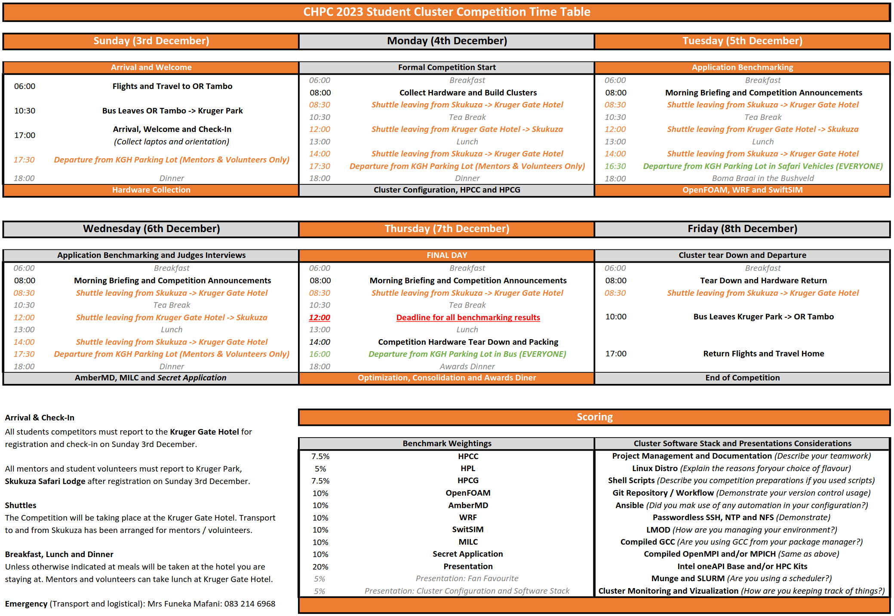

CHPC 2023 Student Cluster Competition
========================================
Benchmarking and Competition instructions for the Center for High Performance Computing (CHPC) 2023 Student Cluster Compettion (SCC). Which is hosted by the National Integrated Cyber Infrastructure Systems (NICIS), a division of the South African Council for Scientific and Industrial Research (CSIR). For 2023 the competition will be held in person at the Kruger Gate Hotel in Mpumalanga, South Africa.

# Getting Started

The benchmarks were chosen to be compatible with the software environment that you previously setup in the first round of this competition. For this round, you are allowed to install any legally obtained software you wish to run the problems. However, using obscure, nonstandard software may limit the support you receive from the competition organizers.

You are strongly encouraged to make use of any resource available to you. However, be advised that the competition organizers will provide limited technical support and assistance in building and running your applications.

Team mentors are encouraged to support and motivate their teams. However, they may not do any of the work for the students. They are strictly there to provide guidance and suggestions, and are there to participate in the conference for their own benefit as well.

Team captains will each be issued a competition USB flash drive. This is how the teams will be issued with their benchmarks and how teams will submit their results. Only the Team captain can approach the organizers’ booth, to submit and/or receive benchmarks. Only one Team captain is allowed at the organizer's booth at any time.

To receive the next set of benchmarks, you will need to make a valid submission of the previous benchmark. Alternatively, you may forfeit penalty points should you be unable to submit a preceding result but want to attempt the next benchmark. The benchmarks will get progressively harder.

The competition organizers will give teams a general indication of where they should be, in the morning at the beginning of the day, and again in the afternoon at the end of the day.

The competition will end on **Thursday, 7th of December at 10:00am**.

Rulings and decisions from the competition organizers are final.

Good Luck!

# Timetable

# Scoring

| Application   | Weight | Breakdown                                                                                                                                  |
| ---           |    --- | ---                                                                                                                                        |
| HPCC & HPCG   |    20% | <ul><li>HPCC *[7.5%]*<ul><li>High Performance Linpack (HPL) *[5%]*</li></ul><li>HPCG *[7.5%]*</li></ul>                                    |
| OpenFOAM      |    10% | <ul><li>Parallel Efficiency Investigation *[4%]*<ul><li>ParaView Visualization *[2%]*</li></ul><li>Simple Benchmark Large *[4%]*</li></ul> |
| AmberMD       |    10% | <ul><li>Explicit Solvent: JAC_Production_NPT_4fs *[2%]* & Solvent: JAC_Production_NVE_4fs *[2%]*<li>Implicit Solvent: Myoglobin *[3%]*<li>Implicit Solvent: Nucleosome *[3%]*</li></ul> |
| WRF           |    10% | <ul><li>Single Domain Case *[4%]*<ul><li> NCL Visualization *[2%]*</li></ul><li>Nested Two-Domain Case *[4%]*</li></ul>                    |
| SwiftSIM      |    10% | <ul><li>Isolated Galaxy Potential *[4%]*<ul><li> PySPHViewer *[2%]*</li></ul><li>Eagle 25 *[4%]*</li></ul>                                 |
| MILC          |    10% | NERSC MILC Medium *[10%]*                                                                                                                  |
| Qiskit-Aer    |    10% | <ul><li>Quantum Volume Experiment *[4%]*<ul><li> Graphs: QV Simulation Time vs Number of Qubits *[2%]*</li></ul><li>Multinode MPI Run *[4%]*</li></ul>                                 |
| Presentation  |    20% | <ul><li>Judges' Scores *[10%]*<li>Cluster Configurations *[5%]*<li>Fan Favorite *[5%]*</li></UL>                                           |

# Instructions for Mentors

The role of Mentors and Volunteers is to provide leadership and guidance for the student competitors participating in this year's Center for High Performance Computing 2023 Student Cluster Competition.

In preparing your teams for the competition, your main goal is to ensure that you teach and impart knowledge to the student participants in such a way that they are empowered and enable to tackle the problems and benchmarking tasks themselves.

## Hands-Off Rule *(You may not touch the keyboard)*

Under no circumstances whatsoever may mentors touch any competition hardware belonging to either their team, or the competition hardware of another team. Mentors are encouraged to provide guidance and leadership to their *(as well as other)* teams.

Any mentors found to be directly in contravention of this rule, may result in their team incurring a penalty. Repeated infringements may result in possible disqualification of their team.

## Main Conference Participation

In addition to supporting their teams, mentors are also **strongly** encouraged to participate in the Main Conference. Shuttles will be available between the Skukuza Safari Lodge *(Main Conference Venue)* and the Kruger Gate Hotel *(Student Cluster Competition Venue)*.

There are a number of interesting talks, panels, workshops, tutorials and tracks [scheduled](https://events.chpc.ac.za/event/125/timetable/#all.detailed) for this year's conference. Coordinate and plan with your teams accordingly, so that you may make the best use of your time here by providing support, as well as enjoying and learning from the conference.

# Cheat Sheet

Below is a table with a number of Linux system commands and utilities that you *may* find useful in assisting you to debug problems that you may encounter with your clusters. Note that some of these utilities do not ship with the base deployment of a number of Linux flavors, and you may be required to install the associated packages, prior to making use of them.

| Command            | Description                                                                                                                                                                                                        |
| ---                | ---                                                                                                                                                                                                                |
| ssh                | Used from logging into the remote machine and for executing commands on the remote machine.                                                                                                                        |
| scp                | SCP copies files between hosts on a network. It uses ssh for data transfer, and uses the same authentication and provides the same security as ssh.                                                                |
| wget / curl        | Utility for non-interactive download of files from the Web.It supports HTTP, HTTPS, and FTP protocols.                                                                                                             |
| top / htop / btop  | Provides a dynamic real-time view of a running system. It can display system summary information as well as a list of processes or threads.                                                                        |
| screen / tmux      | Full-screen window manager that multiplexes a physical terminal between several processes (typically interactive shells).                                                                                          |
| ip a               | Display IP Addresses and property information                                                                                                                                                                      |
| dmesg              | Prints the message buffer of the kernel. The output of this command typically contains the messages produced by the device drivers                                                                                 |
| watch              | Execute a program periodically, showing output fullscreen.                                                                                                                                                         |
| df -h              | Report file system disk space usage.                                                                                                                                                                               |
| ping               | PING command is used to verify that a device can communicate with another on a network.                                                                                                                            |
| lynx               | Command-line based web browser (more useful than you think)                                                                                                                                                        |
| ctrl+alt+[F1...F6] | Open another shell session (multiple ‘desktops’)                                                                                                                                                                   |
| ctrl+z             | Move command to background (useful with ‘bg’)                                                                                                                                                                      |
| du -h              | Summarize disk usage of each FILE, recursively for directories.                                                                                                                                                    |
| lscpu              | Command line utility that provides system CPU related information.                                                                                                                                                 |
| lstotp             | View the topology of a Linux system.                                                                                                                                                                               |
| inxi               | Lists information related to your systems' sensors, partitions, drives, networking, audio, graphics, CPU, system, etc...                                                                                           |
| hwinfo             | Hardware probing utility that provides detailed info about various components.                                                                                                                                     |
| lshw               | Hardware probing utility that provides detailed info about various components.                                                                                                                                     |
| proc               | Information and control center of the kernel, providing a communications channel between kernel space and user space. Many of the preceding commands query information provided by proc, i.e. `cat /proc/cpuinfo`. |
| uname              | Useful for determining information about your current flavor and distribution of your operating system and its version.                                                                                            |
| lsblk              | Provides information about block devices (disks, hard drives, flash drives, etc) connected to your system and their partitioning schemes.                                                                          |
|                    |                                                                                                                                                                                                                    |
